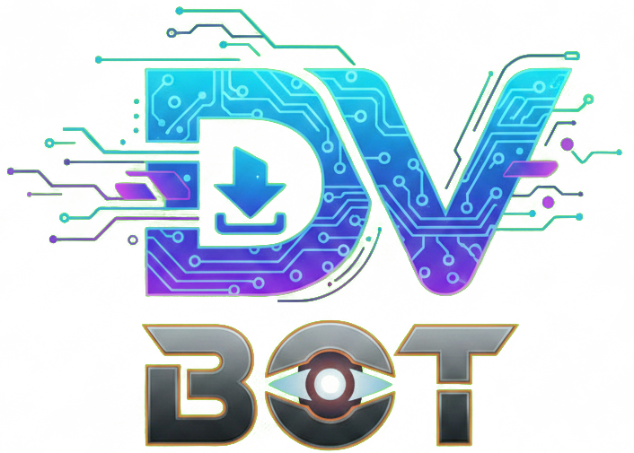

[English](/README.md) | [فارسی](/README.fa_IR.md)

<p align="center">
  <picture>
    <source media="(prefers-color-scheme: dark)" srcset="./media/logo.png">
    
  </picture>
</p>

<div dir="rtl">

# 📥 DV BOT


> یک ربات تلگرامی فوق‌العاده سریع برای دانلود ویدیو — فقط لینک بفرست، ویدیو رو بگیر.  
> طراحی‌شده برای سرورهای اوبونتو با نصب تک‌دستوری.

---

## ✨ قابلیت‌ها

| قابلیت | توضیح |
|---|---|
| ▶️ یوتیوب | دانلود هر ویدیو یا شورتز یوتیوب |
| 📸 اینستاگرام | دانلود ریلز، پست‌ها و استوری‌ها |
| 𝕏 ایکس (توییتر) | دانلود ویدیو از هر پست ایکس |
| ⚡ سرعت بی‌نظیر | پردازش و ارسال فوری ویدیو |
| 📲 دانلود مستقیم | ارسال ویدیو با دکمه دانلود داخل تلگرام |
| 🔧 بدون پیچیدگی | نصب با یک دستور، کاملاً اتوماتیک |

---

## 🚀 نصب سریع

دستور زیر رو روی سرور اوبونتوت اجرا کن:

```bash
bash <(curl -Ls https://raw.githubusercontent.com/saeedpayab/DV_BOT/refs/heads/main/install.sh)
```

### 📋 مراحل نصب

1. **دستور نصب را اجرا کن** — دستور bash بالا رو توی ترمینال پیست کن و Enter بزن.
2. **توکن ربات تلگرامت رو وارد کن** — اسکریپت ازت می‌خواد. فقط توکن رو پیست کن و Enter بزن.
3. **همه چیز خودکار انجام میشه 🎉** — بقیه مراحل اتوماتیک است. ربات چند لحظه دیگه آماده‌ست!

> ⚠️ **توجه:** قبل از نصب، از [@BotFather](https://t.me/BotFather) توکن ربات تلگرام بگیر.

---

## 📖 نحوه استفاده

1. ربات تلگرامت رو باز کن
2. لینک ویدیو از **یوتیوب**، **اینستاگرام** یا **ایکس (توییتر)** بفرست
3. چند لحظه صبر کن تا ربات لینک رو پردازش کنه
4. ویدیو با **دکمه دانلود** مستقیم داخل تلگرام برات ارسال میشه

### 🔗 پلتفرم‌های پشتیبانی‌شده

| پلتفرم | محتوای پشتیبانی‌شده | وضعیت |
|---|---|---|
| ▶️ YouTube | ویدیو، شورتز | ✅ پشتیبانی می‌شه |
| 📸 Instagram | ریلز، پست، استوری | ✅ پشتیبانی می‌شه |
| 𝕏 X (Twitter) | توییت‌های ویدیویی | ✅ پشتیبانی می‌شه |

---

## ⚙️ پیش‌نیازها

- سرور Ubuntu (نسخه‌های 18.04 / 20.04 / 22.04 / 24.04)
- توکن معتبر ربات تلگرام از [@BotFather](https://t.me/BotFather)
- دسترسی به اینترنت از سرور

---

## 📄 مجوز

این پروژه متن‌باز است. برای اطلاعات بیشتر فایل [LICENSE](LICENSE) رو ببین.

---

<p align="center">ساخته‌شده با ❤️ توسط <a href="https://github.com/saeedpayab">saeedpayab</a></p>

</div>
